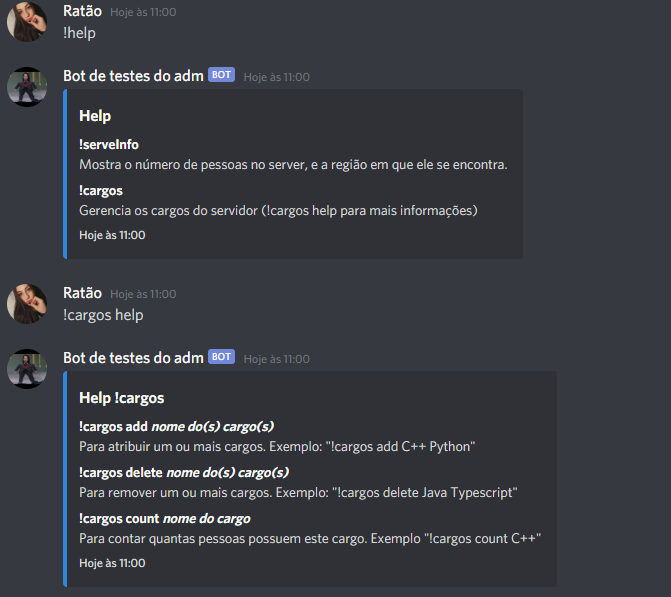
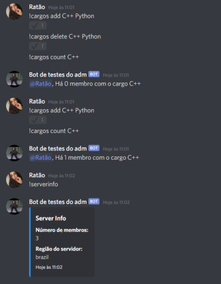

# Role Manager Bot

## Demo

## :hand: Getting Started
- Clone this repo
- Install dependencies with `yarn` or `npm i`
- Install nodemon globally with `npm i -g nodemon`
- Start the bot with `yarn dev` or `npm run dev`
- The bot will be online when it shows "Online" in the console

## :computer: Commands
- `!cargos add ${role_names}`
- `!cargos delete ${role_names}`
- `!cargos count ${role_name}`
- `!cargos help`
- `!serverinfo`

## :recycle: Contributing
- Fork this repo
- Make a branch with your feature
- Describe your commit
- Make a pull request

---

Made with :heart: by <strong>Ian Pons</strong> and <strong>Arthur Guedes</strong>

